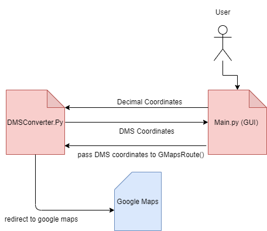
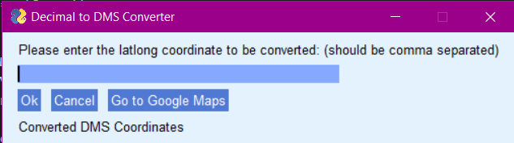
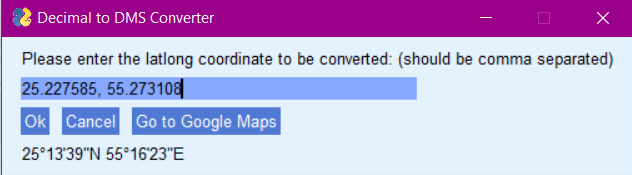
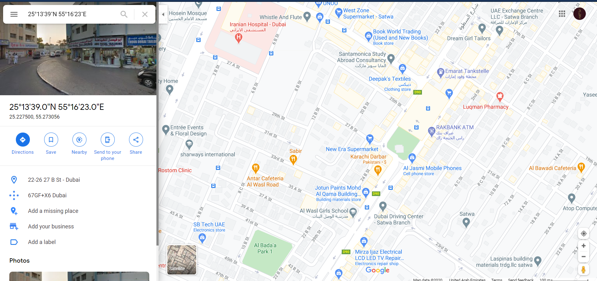

# Decimal-to-DMS-Converter
* A simple python project that converts decimal coordinates to DMS coordinates 
* uses the PyImageGUI library 
* a button redirects the user to google maps to view the DMS coordinates on map 

